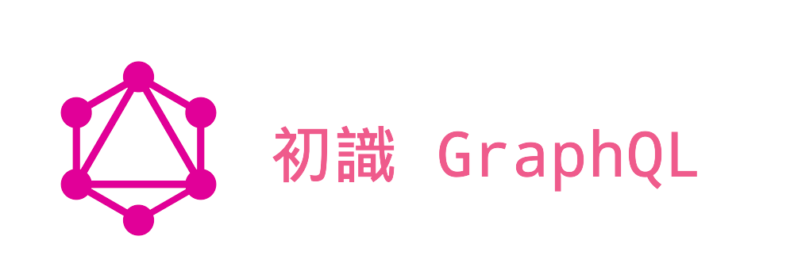

# GraphQL Emoji For Learning



## Motivation

This repository is my learning GraphQL for demonstration.

## Usage

```sh
$ yarn install
```

Running GraphQL Server:

```sh
$ yarn start
```

## Article

初識 GraphQL

- [Medium](https://medium.com/@bivinity/%E5%88%9D%E8%AD%98-graphql-1533032c1121#.1jm8lffg4)
- [GitHub Blog](https://neighborhood999.github.io/2017/01/12/Learning-GraphQL/)

## LICENSE

MIT © [Peng Jie](https://github.com/neighborhood999)
